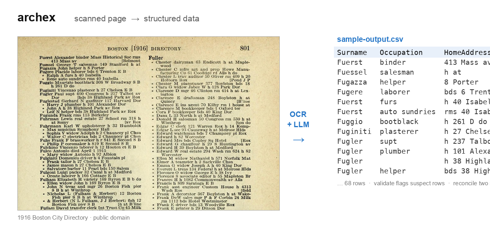

# archex — scanned documents → structured data (OCR + AI)



**Turn scanned historical records, directories, and catalogues into clean,
searchable CSV/JSON.** archex runs OCR over page images, sends the text to an
LLM with *your* schema, and gives you structured rows with page-level
provenance — driven entirely by one YAML config file. No code changes per source.

Great for **genealogy, city directories, census and passenger lists, old
company registries, archives, and digital-humanities** projects where generic
PDF parsers fall short: bad OCR on old print, domain-specific fields, hundreds
of repeating records per page, and citations you can actually footnote.

```
scanned page ─▶ OCR ─▶ LLM (your schema) ─▶ JSON ─▶ normalize ─▶ CSV / XLSX
```

---

## Quickstart (real demo, ~1 minute)

This repo ships a working demo: one page of the **1916 Boston City Directory**
(public domain) → a structured table of residents.

```bash
git clone https://github.com/Bilaldogan/archex && cd archex
pip install -e ".[export]"          # needs the `tesseract` binary too
export GROQ_API_KEY=...             # free key from console.groq.com

archex extract  --profile boston-1916   # OCR + LLM → JSON (the bundled page)
archex validate --profile boston-1916   # flag suspect rows (missing/out-of-range)
archex export   --profile boston-1916 --format csv,xlsx
```

You get ~68 rows like:

| Surname | GivenName | Occupation | WorkAddress | HomeAddress | Page |
|---------|-----------|------------|-------------|-------------|------|
| Fuerst  | Alexander | binder     | Mass Historical Soc | 413 Mass av Belmont | 801 |
| Fugazza | John      | helper     |             | 8 Porter    | 801 |
| Fugler  | Paul      | supt       | 400 Congress | 237 Talbot av Dor | 801 |

(See `examples/sample-output.csv` for the full extracted table.)

## Bring your own source

Everything source-specific lives in `profiles/<name>.yaml`:

- **`ocr`** — engine (tesseract/easyocr), language, preprocessing
- **`llm`** — provider/model + your extraction prompt and output JSON shape
- **`extract.mode`** — `single` (one record per page) or `multi` (many per page)
- **`normalize`** — canonicalise labels + deterministically recompute summaries
- **`validate`** — rules (required / range / regex / enum) that flag suspect rows
- **`reconcile`** — key/compare fields to match the same entity across two sources
- **`export`** — which JSON fields become which columns

```bash
archex init my-source              # scaffold profiles/my-source.yaml
# edit the profile + point it at your images/worklist
archex extract  --profile my-source
archex status   --profile my-source
archex export   --profile my-source --format csv,xlsx
```

A *worklist* (`[{id, images, ...}]`) lists what to process; entry fields feed
your prompt and are preserved under `_source` for provenance. `extract` is
**resumable** — done records are skipped, failures land in `<id>.ERROR.txt`.

## Install

```bash
pip install -e .                  # core (tesseract + groq/openai/ollama)
pip install -e ".[easyocr]"       # optional EasyOCR backend
pip install -e ".[export]"        # optional XLSX export (openpyxl)
```

Requires the `tesseract` binary (`brew install tesseract tesseract-lang` /
`apt install tesseract-ocr`).

## LLM providers

| provider    | env var             | notes                          |
|-------------|---------------------|--------------------------------|
| `groq`      | `GROQ_API_KEY`      | default, free tier, JSON mode  |
| `openai`    | `OPENAI_API_KEY`    | OpenAI-compatible              |
| `ollama`    | —                   | local, no key (`base_url`)     |
| `anthropic` | `ANTHROPIC_API_KEY` | native messages API            |

Set `json_mode: true` (groq/openai) for guaranteed-valid JSON on large pages.

## Example profiles

- `profiles/boston-1916.yaml` — **multi-record**: a city-directory page → 100+
  resident records (name / occupation / address). The quickstart demo.
- `profiles/pech-1911.yaml` — **single-record**: a company catalogue entry →
  company metadata + full board roster with classification and page provenance.

Use either as a template for your own archive.

## Cross-source reconciliation

Match the same entity across two extracted sources and diff the fields you care
about — e.g. two city-directory years to see **who moved or changed jobs**, or
the same company in two catalogues with a different founding date.

```bash
archex reconcile --profile boston-1916 --against boston-1917 \
       --key surname,given_name --compare occupation,home_address
```

Output: a summary (matched / conflicts / only-in-A / only-in-B) plus a
`*.conflicts.csv` with `key, field, value_A, value_B`. Ambiguous keys (the same
name matching multiple records) are reported and skipped rather than mis-paired.

## Roadmap

- Fuzzy entity matching for reconciliation (beyond exact key)
- Human-in-the-loop review — surface `validate`-flagged records for correction

## Keywords

OCR to CSV · extract data from scanned PDF · digitize old records · genealogy
data extraction · city directory OCR · historical records to spreadsheet · LLM
document parsing · structured data extraction · archive digitization.

## License

MIT
